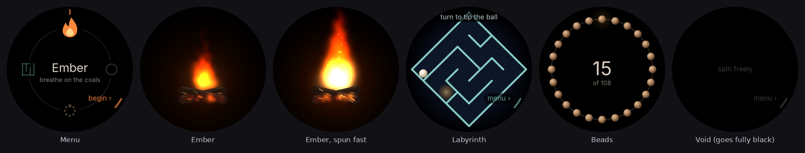

# Bezel Calm

A small Wear OS app for the **Samsung Galaxy Watch8 Classic** (and other Galaxy watches with a
rotating bezel) that gives the bezel something soothing to do, so spinning it doesn't scroll
through your tiles and notifications.



## The modes

| Mode | What the bezel does |
| --- | --- |
| **Ember** | Each click is a breath on a campfire. Turn steadily and it holds a warm fire; spin hard and it roars and throws sparks; stop and it slowly settles back to glowing coals (about a minute). It never goes all the way out. Clockwise leans the flames right, anticlockwise left. |
| **Labyrinth** | The maze turns with the bezel, 15° per click, exactly like the bezel itself. Gravity always pulls toward the bottom of the screen, so you tip the ball through the corridors. Roll it into the glowing cell and a new maze drifts in, growing slowly from 5×5 to 9×9. No timer, no failing. |
| **Beads** | A string of prayer beads around the rim. Every click moves one bead past the top. 108 beads make a round, marked by a gold bead and a soft buzz. |
| **Void** | A black screen that swallows every turn. Made for spinning in a dark theater: the screen stays on but fully black at minimum brightness, so turning the bezel can never wake up a bright watch face. Nothing is drawn after a 3-second hint. |

## Controls

Only the bezel and the buttons do anything. **Touch is ignored on purpose**, so a sleeve, a palm
or an armrest can't change anything.

| Control | On the menu | Inside a mode |
| --- | --- | --- |
| Turn the bezel | Pick a mode (the one at the top is selected) | Play |
| **Back** key (bottom button) | Start the selected mode | Return to the menu |
| **Home** key (top button) | Leave the app | Leave the app |

The app remembers the last mode you chose, so in a theater it's: open Bezel Calm → press Back → Void.

Tip: on the Watch8 Classic you can set the **Quick button** to open Bezel Calm
(Settings → Advanced features → customize the Quick button → Open app → Bezel Calm).

## Installing it on the watch

The ready-to-install file is [`BezelCalm.apk`](BezelCalm.apk). It's rebuilt automatically by
GitHub Actions whenever the code changes. It isn't on the Play Store, so you sideload it once.
Galaxy watches need an Android phone, so the easiest route uses just the phone.

### 1. Turn on developer mode on the watch (one time)

1. On the watch: **Settings → About watch → Software information**.
2. Tap **Software version** repeatedly (5–7 times) until the watch says developer mode is on.
3. Go back to **Settings → Developer options** and turn on **ADB debugging** and
   **Wireless debugging** (allow it when asked).
4. Make sure the watch is on the **same Wi‑Fi** as your phone (Settings → Connections → Wi‑Fi).

### 2. Install from your phone

1. On your phone, download `BezelCalm.apk` (from the link above, or the file sent to you).
2. Install a sideloading app from the Play Store, such as **Wear Installer 2** or **Bugjaeger**.
3. In the watch's **Developer options → Wireless debugging**, tap **Pair new device**. The watch
   shows a pairing code and an IP address with a port.
4. Enter those in the phone app to pair, then choose `BezelCalm.apk` and install.
5. **Bezel Calm** appears in the watch's app list.

### Or install from a computer

With [Android platform-tools](https://developer.android.com/tools/releases/platform-tools)
(`adb`) installed, using the numbers shown under **Wireless debugging** on the watch:

```sh
adb pair 192.168.1.50:41234      # the "Pair new device" address, then type the code
adb connect 192.168.1.50:37000   # the address on the main Wireless debugging screen
adb install BezelCalm.apk
```

When you're done, you can turn **ADB debugging** back off. The app stays installed.

### Theater tips

- Turn on **Do Not Disturb** so notifications don't light up the screen over the Void.
- The Void keeps the screen on (all black) until you leave it, so press Back or Home after the
  movie to let the watch sleep normally. Other modes let the screen sleep after 3 idle minutes.

## For developers

Plain Kotlin and a single custom `View` drawing on a `Canvas`; no libraries. The bezel arrives
as `MotionEvent.AXIS_SCROLL` from `InputDevice.SOURCE_ROTARY_ENCODER` (Galaxy bezels send about
±1.0 per click, clockwise negative), handled in `MainActivity.dispatchGenericMotionEvent`.

```
app/src/main/java/com/josephvia/bezelcalm/
  MainActivity.kt    bezel, Back key, ignored touch, screen-on and brightness
  CalmView.kt        frame loop and switching between menu and modes
  MenuScene.kt       the mode dial
  EmberScene.kt      fire particles; EmberSim.kt holds the heat model
  LabyrinthScene.kt  rotating maze; Maze.kt holds generation and ball physics
  BeadsScene.kt      prayer beads
  VoidScene.kt       nothing, on purpose
```

Build with `./gradlew assembleRelease` (JDK 17+, Android SDK 36). Unit tests for the maze, ball
physics, fire model and bead counter run with `./gradlew testDebugUnitTest`.

The signing key in `keystore/` is committed deliberately, with its password in
`app/build.gradle.kts`. That lets every build install over the previous one. It's only suitable
for a sideloaded personal app, not for a Play Store release.
